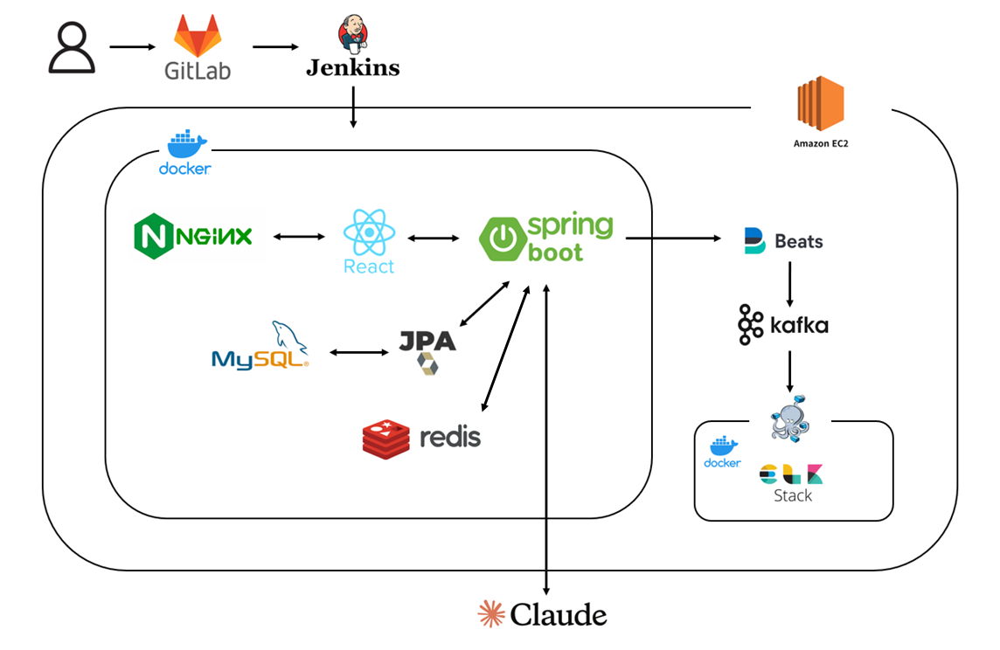
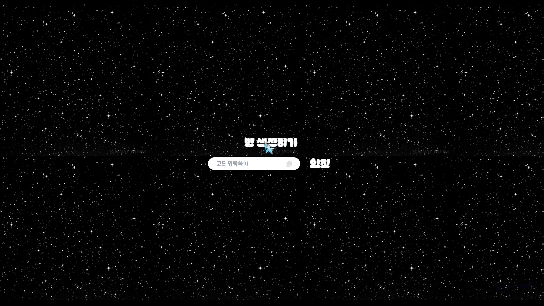
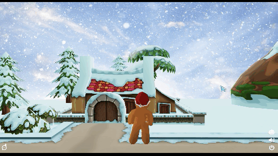
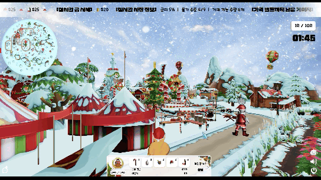
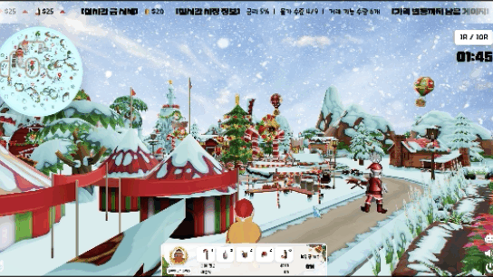
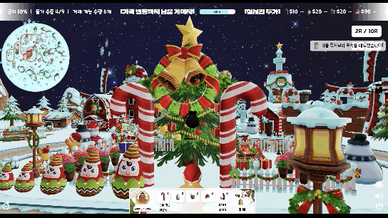

# OMG (Over the Money and Gold)


### Samsung Software Academy For Youth 11th - 특화 프로젝트

> 2024.08.19 ~ 2024.10.16

<br>

### 서비스 소개 영상 : 
https://github.com/user-attachments/assets/d3e4d615-d241-4677-b3f9-5fdec27c5fcc


---

1. [**웹 서비스 소개**](#-웹-서비스-소개)
2. [**기술 스택**](#-기술-스택)
3. [**주요 기능**](#-주요-기능)
4. [**시스템 아키텍쳐**](#-시스템-아키텍쳐)
5. [**프로젝트 파일구조**](#-프로젝트-파일-구조)
6. [**서비스 화면**](#-서비스-화면)
7. [**개발 팀 소개**](#-개발-팀-소개)
8. [**산출물**](#-산출물)

<div id="웹-서비스-소개"></div>
<br>

## ✨ 웹 서비스 소개

---

### ✨ OMG: 크리스마스 마을에서 열리는 투자 전략 게임

경제와 금융 개념을 배우고 싶지만 어렵고 지루하게 느껴진 적이 없으신가요?

기존의 금융 교육용 게임들이 딱딱한 UI와 구식 디자인으로 흥미를 끌지 못했던 경험이 있으신가요?

OMG와 함께 재미있고 직관적으로 경제 개념을 학습해보세요!

#### 🌟 OMG만의 특별함

    ⩥ 현대적이고 친근한 UI: 기존 금융 게임과 달리 세련되고 매력적인 디자인
    ⩥ 게임을 통한 학습: 경제 개념을 쉽고 재미있게 체험하며 이해
    ⩥ 타겟 맞춤형 콘텐츠: 초등학생부터 중학생까지 연령대별 최적화된 학습 경험

#### 💡 이런 분들에게 완벽해요

    ⩥ 경제 개념을 재미있게 배우고 싶은 학생들
    ⩥ 자녀에게 금융 교육을 시키고 싶은 부모님
    ⩥ 게임을 통해 실용적인 지식을 얻고 싶은 모든 분

##### OMG와 함께라면, 경제 공부가 더 이상 어렵지 않습니다. 지금 바로 게임을 통해 미래의 경제 전문가로 성장해보세요!


### **~[OMG와 함께 경제 공부하러 가기](https://j11a206.p.ssafy.io/)~** ( 서비스 종료 )

<div id="기술-스택"></div>
<br>

## 🔨 기술 스택

---

<table>
    <tr>
        <td><b>Back-end</b></td>
        <td>
            
            
            
            <br>
            
            
            
            <br>
            
            
            
            <br>
            
            
        </td>
    </tr>
    <tr>
        <td><b>Front-end</b></td>
        <td> 
            
            
            
            <br>
            
            
            
            <br>
            
            
            
        </td>
    </tr>
    <tr>
        <td><b>Infra</b></td>
        <td>
            
            
            
        </td>
    </tr>
    <tr>
        <td><b>Tools</b></td>
        <td>
            
            
            
            
            
        </td>
    </tr>
</table>
</table>

<br>
<div id="주요-기능"></div>

## 💡 주요 기능

---

|                기능                | 내용                                                                                                                                                                                                                                                    |
| :--------------------------------: | :------------------------------------------------------------------------------------------------------------------------------------------------------------------------------------------------------------------------------------------------------ |
|  **실시간 멀티플레이 경제 게임**   | 웹소켓을 통한 실시간 통신으로 친구들과 함께 즐기는 경제 시뮬레이션 게임입니다. 직관적인 UI로 누구나 쉽게 접근하고 조작할 수 있습니다.                                                                                                                   |
|     **현실 경제 시스템 반영**      | 실제 경제 이벤트와 시장 로직을 게임에 적극 반영하여 현실감 있는 거래와 투자 경험을 제공합니다. 실제 경제 활동을 하는 것과 같은 생동감을 느낄 수 있습니다.                                                                                               |
|       **AI 챗봇 경제 튜터**        | 생성형 AI 챗봇 기능을 통해 게임 내 경제 개념이나 전략에 대해 실시간으로 질문하고 답변을 받을 수 있습니다. 어려운 경제 개념도 대화를 통해 쉽게 이해할 수 있습니다.                                                                                       |
| **게이미피케이션 기반 경제 교육**  | 게이미피케이션 원리를 적용하여 경제 학습을 게임 메커니즘과 유기적으로 결합했습니다. 실시간 경쟁 시스템, 개인 미션 달성, 실시간 리더보드 등을 통해 학습 동기를 유발하고, 복잡한 경제 원리를 직관적으로 체득할 수 있는 상호작용적 학습 경험을 제공합니다. |
| **크리스마스 테마의 3D 게임 세계** | 아름답고 몰입감 있는 크리스마스 마을을 3D로 구현했습니다. 귀여운 캐릭터와 아이템들, 눈 내리는 거리, 반짝이는 장식들이 경제 게임에 따뜻하고 즐거운 분위기를 더합니다. Three.js를 활용한 고품질 3D 그래픽으로 시각적 매력을 극대화했습니다.               |
|                                    |

<br/>

<div id="시스템-아키텍처"></div>
<br>

## 📊 시스템 아키텍쳐

---



<br/>
<div id="프로젝트-파일-구조"></div>

## 📁 프로젝트 파일 구조

---

<details>
<summary>
<h3 style="display: inline-block; margin-right: 10px;">Backend</h3>
</summary>
<div markdown="1">

```
│  .gitignore
│  build.gradle
│  Dockerfile
│  gradlew
│  gradlew.bat
│  settings.gradle
│
├─docker-elk-stack
│  │  .env
│  │  docker-compose.yml
│  │
│  ├─elasticsearch
│  │  │  Dockerfile
│  │  │
│  │  └─config
│  │          elasticsearch.yml
│  │
│  ├─filebeat
│  │  └─config
│  │          filebeat.yml
│  │
│  ├─kibana
│  │  │  Dockerfile
│  │  │
│  │  └─config
│  │          kibana.yml
│  │
│  └─logstash
│      │  Dockerfile
│      │
│      ├─config
│      │      logstash.yml
│      │      pipelines.yml
│      │
│      └─pipeline
│              logstash.conf
│
├─gradle
│  └─wrapper
│          gradle-wrapper.jar
│          gradle-wrapper.properties
│
└─src
    ├─main
    │  ├─java
    │  │  └─com
    │  │      └─ssafy
    │  │          └─omg
    │  │              │  OmgBackApplication.java
    │  │              │
    │  │              ├─config
    │  │              │  │  BaseTimeEntity.java
    │  │              │  │  LoggingController.java
    │  │              │  │  MessageController.java
    │  │              │  │  RedisConfig.java
    │  │              │  │  WebConfig.java
    │  │              │  │  WebSocketConfig.java
    │  │              │  │  WebSocketEventListener.java
    │  │              │  │
    │  │              │  └─baseresponse
    │  │              │          BaseException.java
    │  │              │          BaseResponse.java
    │  │              │          BaseResponseStatus.java
    │  │              │          GlobalExceptionHandler.java
    │  │              │          MessageException.java
    │  │              │          MessageResponseStatus.java
    │  │              │
    │  │              ├─domain
    │  │              │  ├─arena
    │  │              │  │  └─entity
    │  │              │  │          Arena.java
    │  │              │  │
    │  │              │  ├─chat
    │  │              │  │  ├─controller
    │  │              │  │  │      ChatbotController.java
    │  │              │  │  │      ChatController.java
    │  │              │  │  │
    │  │              │  │  ├─dto
    │  │              │  │  │      ChatMessage.java
    │  │              │  │  │
    │  │              │  │  ├─handler
    │  │              │  │  │      ChatHandler.java
    │  │              │  │  │
    │  │              │  │  └─service
    │  │              │  │          ChatbotService.java
    │  │              │  │          ChatbotServiceImpl.java
    │  │              │  │
    │  │              │  ├─game
    │  │              │  │  │  GameRepository.java
    │  │              │  │  │
    │  │              │  │  ├─controller
    │  │              │  │  │      CommonMessageController.java
    │  │              │  │  │      GameController.java
    │  │              │  │  │      IndividualMessageController.java
    │  │              │  │  │
    │  │              │  │  ├─dto
    │  │              │  │  │      BattleClickDto.java
    │  │              │  │  │      BattleRequestDto.java
    │  │              │  │  │      BattleResultDto.java
    │  │              │  │  │      ClickStatusDto.java
    │  │              │  │  │      GameEventDto.java
    │  │              │  │  │      GameNotificationDto.java
    │  │              │  │  │      GameResultResponse.java
    │  │              │  │  │      GameStatusDto.java
    │  │              │  │  │      GoldMarketInfoResponse.java
    │  │              │  │  │      IndividualMessageDto.java
    │  │              │  │  │      MainMessageDto.java
    │  │              │  │  │      MoneyCollectionRequest.java
    │  │              │  │  │      MoneyCollectionResponse.java
    │  │              │  │  │      PlayerDistanceDto.java
    │  │              │  │  │      PlayerMinimapDto.java
    │  │              │  │  │      PlayerMoveRequest.java
    │  │              │  │  │      PlayerRankingResponse.java
    │  │              │  │  │      PlayerResponse.java
    │  │              │  │  │      PlayerStateDto.java
    │  │              │  │  │      RoundStartNotificationDto.java
    │  │              │  │  │      StockFluctuationResponse.java
    │  │              │  │  │      StockMarketResponse.java
    │  │              │  │  │      StockRequest.java
    │  │              │  │  │      TimeNotificationDto.java
    │  │              │  │  │      UserActionDTO.java
    │  │              │  │  │
    │  │              │  │  ├─entity
    │  │              │  │  │      Game.java
    │  │              │  │  │      GameEvent.java
    │  │              │  │  │      GameStatus.java
    │  │              │  │  │      LoanProduct.java
    │  │              │  │  │      MoneyPoint.java
    │  │              │  │  │      MoneyState.java
    │  │              │  │  │      RoundStatus.java
    │  │              │  │  │      StockInfo.java
    │  │              │  │  │      StockState.java
    │  │              │  │  │
    │  │              │  │  ├─repository
    │  │              │  │  │      GameEventRepository.java
    │  │              │  │  │
    │  │              │  │  └─service
    │  │              │  │      │  GameBroadcastService.java
    │  │              │  │      │  GameEventListener.java
    │  │              │  │      │  GameScheduler.java
    │  │              │  │      │  GameService.java
    │  │              │  │      │  GameServiceImpl.java
    │  │              │  │      │
    │  │              │  │      └─battle
    │  │              │  │              BattleState.java
    │  │              │  │              GameBattleService.java
    │  │              │  │
    │  │              │  ├─player
    │  │              │  │  ├─dto
    │  │              │  │  │      PlayerAnimation.java
    │  │              │  │  │      PlayerInfo.java
    │  │              │  │  │      PlayerResult.java
    │  │              │  │  │
    │  │              │  │  └─entity
    │  │              │  │          Player.java
    │  │              │  │          PlayerAction.java
    │  │              │  │          PlayerStatus.java
    │  │              │  │
    │  │              │  ├─room
    │  │              │  │  ├─controller
    │  │              │  │  │      RoomController.java
    │  │              │  │  │      RoomMessageController.java
    │  │              │  │  │
    │  │              │  │  ├─dto
    │  │              │  │  │      CommonRoomRequest.java
    │  │              │  │  │      CommonRoomResponse.java
    │  │              │  │  │
    │  │              │  │  ├─entity
    │  │              │  │  │      InRoomPlayer.java
    │  │              │  │  │      Room.java
    │  │              │  │  │
    │  │              │  │  └─service
    │  │              │  │          RoomService.java
    │  │              │  │          RoomServiceImpl.java
    │  │              │  │
    │  │              │  ├─socket
    │  │              │  │  └─dto
    │  │              │  │          StompExceptionPayload.java
    │  │              │  │          StompPayload.java
    │  │              │  │          StompResponsePayload.java
    │  │              │  │
    │  │              │  └─user
    │  │              │      ├─controller
    │  │              │      │      UserController.java
    │  │              │      │
    │  │              │      ├─entity
    │  │              │      │      User.java
    │  │              │      │
    │  │              │      ├─repository
    │  │              │      │      UserRepository.java
    │  │              │      │
    │  │              │      └─service
    │  │              │              UserService.java
    │  │              │              UserServiceImpl.java
    │  │              │
    │  │              └─util
    │  │                      RedisUtil.java
    │  │
    │  └─resources
    │      │  application-prod.yml
    │      │  application.yml
    │      │  banner.txt
    │      │
    │      └─static
    │              index.html
    │              websocket-test.html
    │
    └─test
        └─java
            ├─com
            │  └─ssafy
            │      └─omg
            │          └─domain
            │              └─game
            │                  ├─controller
            │                  │      GameMessageControllerTest.java
            │                  │
            │                  └─service
            │                          GameBroadcastServiceTest.java
            │
            └─omg
                └─ssafy
                        OmgBackApplicationTests.java
```

</div>
</details>

<details>
<summary>
<h3 style="display: inline-block; margin-right: 10px;">Frontend</h3>
</summary>
<div markdown="1">

```
│  .env.sample
│  .gitignore
│  .prettierignore
│  .prettierrc
│  Dockerfile
│  dump.rdb
│  eslint.config.js
│  index.html
│  nginx.conf
│  package-lock.json
│  package.json
│  postcss.config.js
│  README.md
│  svg.d.ts
│  tailwind.config.js
│  tsconfig.app.json
│  tsconfig.json
│  tsconfig.node.json
│  tsconfig.tsbuildinfo
│  vite.config.d.ts
│  vite.config.js
│  vite.config.ts
│
├─public
│  │  android-chrome-192x192.png
│  │  android-chrome-512x512.png
│  │  apple-touch-icon.png
│  │  favicon-16x16.png
│  │  favicon-32x32.png
│  │  favicon.ico
│  │  site.webmanifest
│  │
│  ├─assets
│  │      alert.jpeg
│  │      candy.png
│  │      chat.png
│  │      cupcake.png
│  │      elf.png
│  │      event-card1.jpg
│  │      event-card2.jpg
│  │      event-card3.jpg
│  │      game-access-level.png
│  │      game-bg.png
│  │      gift.png
│  │      gingerbread.png
│  │      gold.png
│  │      goldbell.png
│  │      hat.png
│  │      loan-card.jpg
│  │      loan-sheet.jpg
│  │      logo.png
│  │      matrix.gif
│  │      matrix2.gif
│  │      mini-map.png
│  │      money.png
│  │      morning-sky.jpg
│  │      myroom.jpg
│  │      night-sky.jpg
│  │      rudolph.png
│  │      santa.png
│  │      shopping-basket.png
│  │      slough.png
│  │      snow.png
│  │      snowman.png
│  │      socks.png
│  │      stock-fluctuation.png
│  │      trade-button.png
│  │      white-chat.png
│  │
│  ├─models
│  │  ├─candy
│  │  │      Atlas_Xmas_Items_01.png
│  │  │      candy.bin
│  │  │      candy.gltf
│  │  │
│  │  ├─cupcake
│  │  │      cupcake.bin
│  │  │      cupcake.gltf
│  │  │      Material_001_Base_Color.png
│  │  │
│  │  ├─elf
│  │  │      elf.bin
│  │  │      elf.gltf
│  │  │      material_0_baseColor.png
│  │  │
│  │  ├─gift
│  │  │      gift.bin
│  │  │      gift.gltf
│  │  │      gift_DefaultMaterial_BaseColor.png
│  │  │      gift_DefaultMaterial_Metallic-gift_DefaultMaterial_Roughness.png
│  │  │      gift_DefaultMaterial_Normal.png
│  │  │
│  │  ├─gingerbread
│  │  │      elf-rudoft-ginger-gift.png
│  │  │      gingerbread.bin
│  │  │      gingerbread.gltf
│  │  │
│  │  ├─gold
│  │  │      gold.bin
│  │  │      gold.gltf
│  │  │
│  │  ├─goldbell
│  │  │      goldbell.bin
│  │  │      goldbell.gltf
│  │  │
│  │  ├─hat
│  │  │      0_ChristmasHat4_white_hat_BaseColor.jpg
│  │  │      hat.bin
│  │  │      hat.gltf
│  │  │
│  │  ├─map
│  │  │  │  license.txt
│  │  │  │  scene.bin
│  │  │  │  scene.gltf
│  │  │  │
│  │  │  └─textures
│  │  │          06_-_Defagggult_baseColor.png
│  │  │          13_-_Defaultdsf_baseColor.png
│  │  │          15_-_Default3_baseColor.png
│  │  │          19_-_Defauladads_baseColor.png
│  │  │          19_-_Default_baseColor.png
│  │  │          20_-_Defaufsddfdflt_baseColor.png
│  │  │          20_-_Defaulth_baseColor.png
│  │  │          20_-_Default_baseColor.png
│  │  │          Material_135_baseColor.png
│  │  │          Material_139_baseColor.png
│  │  │          Material_140_baseColor.png
│  │  │          Material_261_baseColor.png
│  │  │          Material_262_baseColor.png
│  │  │          Material_263_baseColor.png
│  │  │          Material_26_baseColor.png
│  │  │          Material_427_baseColor.png
│  │  │          Material_427_metallicRoughness.png
│  │  │          Material_428_baseColor.png
│  │  │          Material_429_baseColor.png
│  │  │          Material_431_baseColor.png
│  │  │          Material_432_baseColor.png
│  │  │          Material_434_baseColor.png
│  │  │          Material_438_baseColor.png
│  │  │          Material_439_baseColor.png
│  │  │          Material_440_baseColor.png
│  │  │          Material_45_baseColor.png
│  │  │          Material_46_baseColor.png
│  │  │          Material_47_baseColor.png
│  │  │
│  │  ├─pouch
│  │  │      pouch.bin
│  │  │      pouch.gltf
│  │  │
│  │  ├─santa
│  │  │      material_0_baseColor.png
│  │  │      santa.bin
│  │  │      santa.gltf
│  │  │
│  │  ├─silver
│  │  │      silver.bin
│  │  │      silver.gltf
│  │  │
│  │  ├─snowman
│  │  │      snowman.bin
│  │  │      snowman.gltf
│  │  │      Snowman_baseColor.png
│  │  │
│  │  ├─socks
│  │  │      elf-rudoft-ginger-gift.png
│  │  │      socks.bin
│  │  │      socks.gltf
│  │  │
│  │  └─stocktree
│  │          Atlas_Xmas_Items_02.png
│  │          stocktree.bin
│  │          stocktree.gltf
│  │
│  ├─music
│  │      background.mp3
│  │      bell-alert.mp3
│  │      change-price-alert.mp3
│  │      chat-alert.mp3
│  │      click-chat-alert.mp3
│  │      finish-game-alert.mp3
│  │      get-coin-alert.mp3
│  │      get-item-alert.mp3
│  │      gold-alert.mp3
│  │      left-time-alert.mp3
│  │      loan-alert.mp3
│  │      round-end-alert.mp3
│  │      stock-alert.mp3
│  │      typing-sound.mp3
│  │
│  └─system
│          cursor.cur
│
└─src
    │  App.tsx
    │  index.css
    │  main.tsx
    │  vite-env.d.ts
    │
    ├─apis
    │  │  apiConstants.ts
    │  │  axiosInstance.ts
    │  │  errorHandler.ts
    │  │
    │  └─room
    │          roomAPI.ts
    │
    ├─assets
    │  ├─data
    │  │      characterInfo.ts
    │  │      coinLocation.ts
    │  │      goldMarketData.ts
    │  │      introduction.ts
    │  │      loanLimitLogic.ts
    │  │      locationInfo.ts
    │  │      nicknameData.ts
    │  │      stockMarketData.ts
    │  │
    │  └─img
    │          bg-personal1.svg
    │          bg-personal2.svg
    │          mini-elf.svg
    │          mini-gingerbread.svg
    │          mini-santa.svg
    │          mini-snowman.svg
    │          rank1.svg
    │          rank2.svg
    │          rank3.svg
    │
    ├─components
    │  ├─camera
    │  │      IntroCamera.tsx
    │  │
    │  ├─character
    │  │      Character.tsx
    │  │      Item.tsx
    │  │
    │  ├─chat
    │  │      ChatBotInteraction.tsx
    │  │      ChatInputForm.tsx
    │  │      ChatMessage.tsx
    │  │      Chatting.tsx
    │  │
    │  ├─common
    │  │      BackButton.tsx
    │  │      Button.tsx
    │  │      ChatButton.tsx
    │  │      CommonLoader.tsx
    │  │      ExitButton.tsx
    │  │      Gauge.tsx
    │  │      index.ts
    │  │      Notification.tsx
    │  │      Round.tsx
    │  │      Snowing.tsx
    │  │      SpeechBubble.tsx
    │  │      Timer.tsx
    │  │
    │  ├─game
    │  │      CanvasLoader.tsx
    │  │      EventCard.tsx
    │  │      EventEffect.tsx
    │  │      GameLoader.tsx
    │  │      GamePersonalResult.tsx
    │  │      GameResult.tsx
    │  │      GameTotalResult.tsx
    │  │      index.ts
    │  │
    │  ├─gold-market
    │  │      GoldBuy.tsx
    │  │      GoldMarket.tsx
    │  │      GoldModel.tsx
    │  │      LineChart.tsx
    │  │      PossessionChart.tsx
    │  │
    │  ├─loan-market
    │  │      LoanInfo.tsx
    │  │      LoanLogicModal.tsx
    │  │      LoanMarket.tsx
    │  │      LoanReport.tsx
    │  │      LoanSheet.tsx
    │  │
    │  ├─main-map
    │  │      MainMap.tsx
    │  │      Map.tsx
    │  │      MarketStatusBoard.tsx
    │  │      Tutorial.tsx
    │  │
    │  ├─mini-game
    │  │  ├─battle
    │  │  │      Counter.tsx
    │  │  │
    │  │  └─money
    │  │          MoneyCanvas.tsx
    │  │
    │  ├─mini-map
    │  │      MiniMap.tsx
    │  │
    │  ├─my-room
    │  │      MyRoom.tsx
    │  │
    │  ├─notification
    │  │      DefaultAlert.tsx
    │  │      getAlertComponent.tsx
    │  │      index.ts
    │  │      LeftTimeAlert.tsx
    │  │      RoundEndAlert.tsx
    │  │      StockChangeAlert.tsx
    │  │
    │  ├─personal-board
    │  │      PersonalBoard.tsx
    │  │
    │  └─stock-market
    │          index.ts
    │          Item.tsx
    │          LineChart.tsx
    │          MarketState.tsx
    │          PossessionChart.tsx
    │          StockBuy.tsx
    │          StockInfoButton.tsx
    │          StockMain.tsx
    │          StockMarket.tsx
    │          StockSell.tsx
    │          Tree.tsx
    │
    ├─hooks
    │      index.ts
    │      useCharacter.ts
    │      useCountUp.ts
    │      useFloatingObject.ts
    │      useGold.ts
    │      useGoldSwing.ts
    │      useSocket.ts
    │      useStock.ts
    │      useWaitingRoom.ts
    │
    ├─pages
    │      404.tsx
    │      Game.tsx
    │      Lobby.tsx
    │      Login.tsx
    │      Waiting.tsx
    │
    ├─stores
    │      index.ts
    │      useAlertStore.ts
    │      useGameResultStore.ts
    │      useGameStore.ts
    │      useGoldStore.ts
    │      useIntroStore.ts
    │      useLoanStore.ts
    │      useMainBoardStore.ts
    │      useMiniMapStore.ts
    │      useMiniMoneyStore.ts
    │      useModalStore.ts
    │      useMyRoomStore.ts
    │      useOtherUserStore.ts
    │      usePersonalBoardStore.ts
    │      useSocketMessage.ts
    │      useSoundStore.ts
    │      useStockStore.ts
    │      useUser.ts
    │
    ├─types
    │      index.ts
    │
    └─utils
            ConfirmAlert.ts
            formatNumberWithCommas.ts
            formatTime.ts
            index.ts
            SocketContext.tsx
            ToastAlert.ts
```

</div>
</details>

<br>
<div id="서비스-화면"></div>

## 💻 서비스 화면

---

### 방 생성 및 게임 시작

-   방장이 방을 생성하고 네 명의 플레이어가 모이면 게임 시작 버튼이 활성화됩니다.



### 튜토리얼

-   기본적인 키 조작 방법 및 게임 룰에 대한 안내를 제공합니다.



### 플레이어 간 상호작용

-   미니맵을 통해 다른 플레이어들의 위치를 확인할 수 있습니다.
-   실시간 거래상황을 확인할 수 있습니다.
-   다른 플레이어와 가까워지면 상대방의 실시간 순위를 확인할 수 있습니다.



### 대출 및 상환


### 주식 매수

-   5가지 주식의 남은 수량과 시가를 확인할 수 있습니다.
-   물가 수준에 기반한 최대 거래 수량 만큼 거래 가능합니다.
-   주식 매수 시, 실시간으로 주가 차트 및 지분 차트가 업데이트 됩니다.
-   주식을 사면, 머리 위 선물 주머니에 담아 가지고 이동할 수 있습니다.


### 주식 매도

-   집에서 가져온 주식을 확인할 수 있습니다.
-   물가 수준에 기반한 최대 거래 수량 만큼 거래 가능합니다.
-   주식 매도 시, 실시간으로 주가 차트 및 지분 차트가 업데이트 됩니다.
  


### 금 매입


### 미니맵



### 주가변동 발생

-   주식 매도 행위가 일어나면, 주가 변동을 위한 게이지가 20%씩 상승합니다.
-   주식 매수 또는 금 매입 행위가 일어나면, 내부 로직에 따라 주가 변동이 가능합니다.



### 돈 줍기 행동

-   스페이스 바를 통해 행운의 코인을 획득할 수 있습니다.


### 개인 집 방문

-   게임이 시작된 후 초기 위치는 자신의 집입니다.
-   주식을 매수하면, 한 라운드가 끝나기 전에 자신의 집에 가지고 와야 합니다. (penalty: 현금 감소)
-   주식을 매도하려면, 집에서 주식을 챙겨가야 합니다.
-   주식을 챙기면, 머리 위 선물 주머니에 담아 가지고 이동할 수 있습니다.


### 챗봇

-   우측 하단의 챗봇 아이콘을 토글하여 AI 챗봇에게 투자 조언을 구할 수 있습니다.


### 라운드 종료 및 대출 이자 변동

-   한 라운드가 끝나면, 해당 라운드에서 대출한 금액 및 금리를 고려해 이자가 부여됩니다.


<br>
<div id="개발-팀-소개"></div>

## 👨🏻‍💻 개발 팀 소개

---

|  |  |  |  |  |  |
| :----------------------------------------------------------------------------------------: | :-----------------------------------------------------------------------------------------: | :----------------------------------------------------------------------------------------: | :-----------------------------------------------------------------------------------------: | :-----------------------------------------------------------------------------------------: | :----------------------------------------------------------------------------------------: |
|               [강다현<br>@hyun3745](https://github.com/hyun3745)<br/>`FRONTEND`                |       [강한나<br>@hannabananah](https://github.com/hannabananah)<br/>`LEADER`<br>`MAIN FRONTEND`        |         [김현재<br>@Kguswo](https://github.com/Kguswo)<br/>`MAIN BACKEND`<br>`AI`          |           [박희연<br>@hi-react](https://github.com/hi-react)<br/>`FRONTEND` <br> `AI`           |                [이가은<br>@Celinemad](https://github.com/Celinemad)<br/>`BACKEND`                 |          [전정민<br>@imjm](https://github.com/imjm)<br/>`BACKEND`<br>`INFRA`           |

<br />
<div id="산출물"></div>

## 📝 산출물

---

### 1. [기능 명세서](https://fresh-source-ce8.notion.site/d963e898d603491695c5ecb0e6e2c11b?pvs=4)

### 2. [와이어 프레임](https://www.figma.com/design/OregQsBVThLD4IEb6mYM5g/206?node-id=389-10482&node-type=canvas&t=FpZOWWp1XhObbsB7-0)

### 3. [API 명세서](https://fresh-source-ce8.notion.site/API-d36b4af91cd24feeae262effd46fe6d1?pvs=4)

### 4. [ERD](https://fresh-source-ce8.notion.site/ERD-Diagram-b00e6ea347c04107b8069261c190b103?pvs=4)

### 5. [포팅매뉴얼](https://fresh-source-ce8.notion.site/ba823524002c45f79cd21f6bd728bab8?pvs=4)
